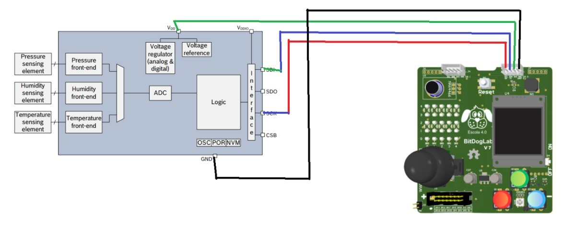
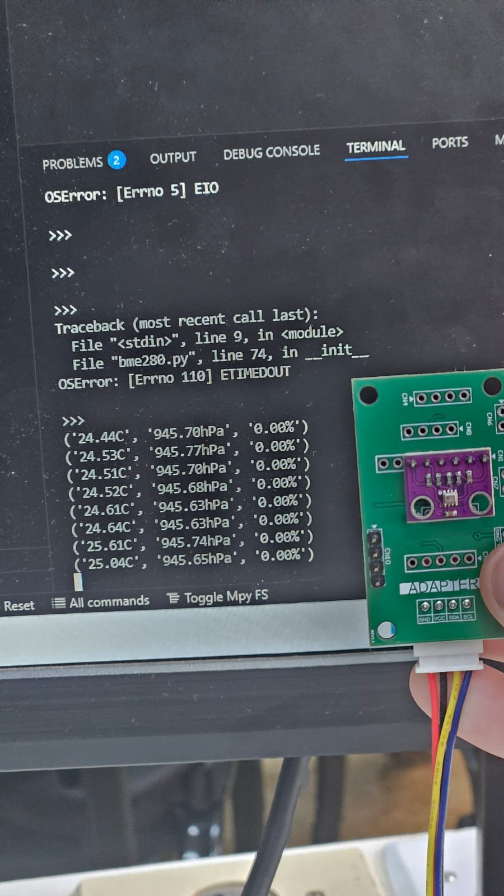
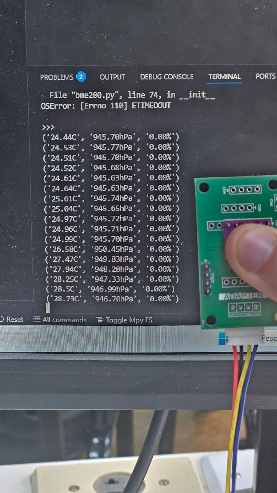

# <NOME DO SENSOR> — Sensores na BitDogLab

**Dupla:** Bruno Soria(216041/bruno.aira.soria@gmail.com, Pedro Crocco(239933/p239933@dac.unicamp.br) 
**Turma:** EA701 A— 2025S2  
**Repositório:** https://github.com/ChristopherSoria/EA701_2025S2_Sensores_BitDogLab

## 1. Descrição do sensor
- Fabricante / modelo: Bosch Sensortec - BME280
- Princípio de funcionamento: Sensor integrado de pressão e temperatura. Sensor de pressão é composto de um diafragma de silício com resistores piezorresistivos. O sensor de temperatura é composto de termistores.
- Tensão/consumo típicos: — Pressão + Temp @ 1 Hz: ~2,8 µA
- Faixa de medição / resolução:
 Operação: -40 a +85 °C para temperatura. 
 Pressão: 300 - 1100 hPa para pressão atmosférica.
- Datasheet (URL): https://www.bosch-sensortec.com/media/boschsensortec/downloads/datasheets/bst-bme280-ds002.pdf

## 2. Conexões de hardware
**Tabela de conexões:**  


## 3. Dependências
MicroPython/C versão:
Recomendado: MicroPython v1.21.0 

Bibliotecas utilizadas:
.machine — biblioteca nativa do MicroPython para GPIO e I²C
.time — biblioteca nativa para controle de tempo (sleep, sleep_us)
.ustruct — biblioteca nativa usada para empacotar/desempacotar dados binários
.array — biblioteca nativa usada para armazenar dados em formato binário
.bme280.py — biblioteca local (arquivo fornecido no projeto)

Como instalar:
1.Instale o MicroPython na placa (via Thonny IDE
 → Ferramentas → Opções → Interprete → Instalar firmware MicroPython).
2.Conecte a placa via USB e abra o Thonny.
3.Copie os arquivos do projeto para a placa:
 .bme280.py → raiz da placa
 .main.py → raiz da placa (executa automaticamente na inicialização)
4.Salve e execute o script (main.py) pelo Thonny.

## 4. Como executar
Via MicroPython(Thonny):
1.Abra o Thonny.
2.Conecte a placa.
3.No painel da esquerda, copie o arquivo src/main.py para a placa.
4.Clique em Executar → Executar no dispositivo.
5.O terminal começará a exibir os resultados

## 5. Exemplos de uso
src/blink.py — leitura bruta
Lê diretamente os valores crus do sensor (sem compensação), útil para testes de comunicação.

src/blink_média.py — leitura com média móvel
Faz várias leituras consecutivas e calcula a média para reduzir ruído nas medições.

## 6. Resultados e validação



## 7. Licença
- Ver arquivo `LICENSE`.

---

> **Checklist de entrega**
> - [ ] README preenchido  
> - [ ] Foto/diagrama em `docs/`  
> - [ ] Código comentado em `src/`  
> - [ ] Testes em `test/` com instruções  
> - [ ] `relatorio.md` com lições aprendidas

## 📁 7. Estrutura do Repositório

O projeto segue o padrão definido pela disciplina EA801 — Sistemas Embarcados, 
visando padronizar as entregas e facilitar o reuso dos códigos e documentação.

Todos os arquivos de código devem estar em src/.
Diagramas, fotos, gráficos e documentos vão em docs/.
Scripts ou logs de teste ficam em test/.
O relatório técnico (relatorio.md) documenta todo o processo de engenharia.

Mantenha os nomes dos arquivos em minúsculas, sem acentos ou espaços, usando _ ou -.

```text
template_sensor/
├── README.md          → Descrição completa do projeto (sensor, ligações, execução e checklist)
├── relatorio.md       → Relatório técnico da dupla (resultados, análise e conclusões)
├── LICENSE            → Licença MIT de uso e distribuição
├── .gitignore         → Regras para ignorar arquivos temporários e binários
│
├── docs/              → Documentação e mídias
│   ├── ligacao.jpg    → Diagrama ou foto da ligação na BitDogLab
│   ├── esquema.pdf    → Esquemático opcional
│   └── outros arquivos de apoio
│
├── src/               → Códigos-fonte principais
│   ├── main.py        → Código principal (MicroPython)
│   ├── main.c         → Versão alternativa (C / Pico SDK)
│   ├── exemplos/      → Códigos ilustrativos adicionais
│   └── bibliotecas/   → Drivers, módulos auxiliares
│
└── test/              → Testes e validações
    ├── test_basico.py → Teste de leitura e resposta do sensor
    ├── test_ruido.py  → Avaliação de ruído ou estabilidade
    └── logs/          → Registros experimentais, dados e gráficos

```
